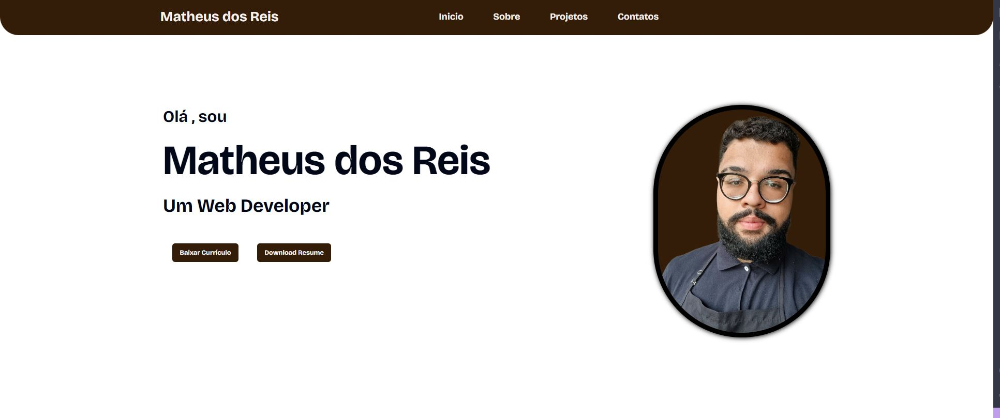

# Portfolio Reis567 React

Este é o repositório do meu aplicativo React, que funciona como o meu portfólio online. Aqui está uma breve visão geral da estrutura do projeto, suas principais funcionalidades, e informações sobre o deploy e link do GitHub.

## Estrutura de Pasta

- **src**: Contém o código-fonte do meu aplicativo. Aqui, você encontrará meus componentes reutilizáveis em `components` e as principais páginas em `pages`. O componente principal `App.tsx` define a estrutura global da página, e a configuração do roteamento está em `main.tsx` utilizando `react-router-dom`.
- **public**: Diretório contendo arquivos estáticos, como imagens e currículos.
- **package.json**: Arquivo de configuração do Node.js com as dependências e scripts do projeto.
- **vite.config.ts**: Configuração do Vite, um bundler/empacotador utilizado no projeto.

## Funcionalidades Principais

1. **Página Inicial (`/`)**:
   - Apresento informações introdutórias sobre mim.
   - Você encontrará links para baixar meu currículo em inglês e português.

2. **Página de Contatos (`/contatos`)**:
   - Listo diversas formas de contato, como e-mail, LinkedIn e GitHub.

3. **Página de Projetos (`/projetos`)**:
   - Apresento uma lista dos meus principais projetos desenvolvidos até agora.
   - Cada projeto exibe uma descrição, tecnologias utilizadas e um link para o código-fonte no GitHub.

4. **Página Sobre (`/sobre`)**:
   - Destaco minhas habilidades, utilizando estrelas para representar o nível de proficiência em cada tecnologia.
   - Forneci uma breve descrição sobre mim, destacando pontos fortes como trabalho em equipe e ambição.

## Deploy

Meu aplicativo está disponível online em [matheusdosreis.com](https://matheusdosreis.com).

## GitHub

O código-fonte está disponível no [GitHub](https://github.com/Reis567/resume-react). Sinta-se à vontade para explorar o código-fonte e adaptar conforme suas necessidades. Boa sorte!
